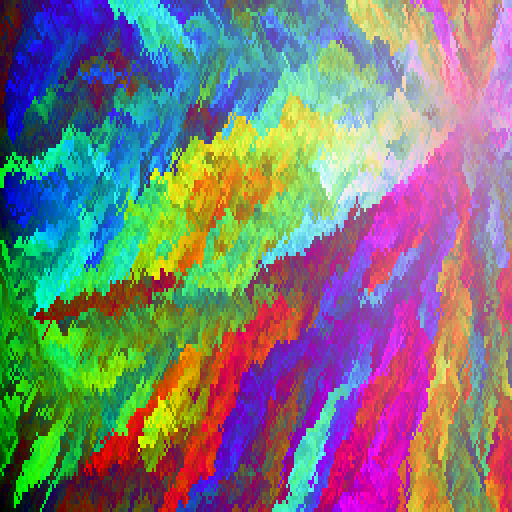
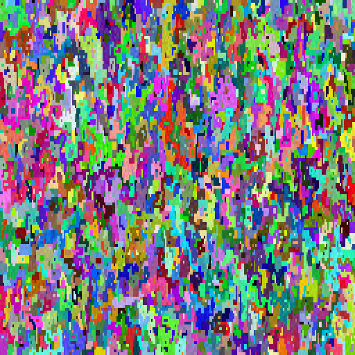

# Algorithmic Art

Or, what nowadays one might call "non-AI generative art." This is just me playing with some simple algorithms, inspired by an [old Stack Exchange code golf](https://codegolf.stackexchange.com/questions/22144/images-with-all-colors).

The original challenge was to take the list of 32768 15-bit colors to create a 256 x 128 image where every color is used exactly once. I've done that, and then adapted the original solutions to optionally take the list of colors from another image. Any duplicate colors in the list are kept; the generated image will have colors in the same distribution as the original source.

I also cheat a bit; the images I generate are the same size as their source image (256 x 128 in the 15-bit color case); I then resize to the desired size using `PIL.Image.resize()`
with `Image.Resampling.NEAREST` to upsample while preserving the original list of colors. Using the default resampling filter (BICUBIC) produces lovely smoothed images, 
but obscures the properties of the original algorithms.

The code is by no means speed-optimized or production-ready, but here it is for you to play with, anyway. For reference, I used Python 3.11.8 and PIL 10.2.0.

## Generate by Color Similarity

This is inspired by [the code golf submission](https://codegolf.stackexchange.com/a/22326) from user fejesjoco, though it's not the same. I pick a initial pixel and color at random, then place each subsequent color such that it's nearest to the colors of its filled neighbors. 
The "neighbor distance" metric is the minimum distance from a pixel's filled neighbors.

This is the slowest of the algorithms. Here is an example output (resized to 512x512):



Basic usage:
```
from PIL import Image
import numpy as np
from generators.nearcolors import nearcolors_image

# Takes about 2 - 6 minutes, depending on starting point location
img = nearcolors_image()
img.show()
# img.save('nearcolors.png')

```

More examples, including getting the colorlist from an existing image, are in `nearcolors.ipynb`.

## Generate by a Series of Random Walks

I pick a initial pixel and color, then sort the remaining unplaced colors by distance from the original color. I then do a random walk (up/down/left/right) to an uncolored neighbor, filling it with the next color. I do this until get to a dead end (ie my current pixel has no uncolored neighbors). I then pick a new random unfilled start pixel, and a new random unused color, and start another walk. This goes until I run out of colors (and simultaneously fill all the pixels).



Basic usage:
```
from PIL import Image
import numpy as np
from generators.randomwalk import randomwalk_image

# Takes about 3-4 minutes
img = randomwalk_image()
img.show()
# img.save('randomwalk.png')
```
More examples in `randomwalk.ipynb`.

## Random Walk of a Bug in Paint

A random walk on a square, but this time the "bug" (pixel) can cross its own path, and I don't try to fill every pixel. Each "footstep" is a color from the provided colorlist. By default, I start with a random color, and the re-sort the colorlist by distance from the starting color, but you can also just walk the colorlist in the order given, which makes really interesting images when you start from an actual image (as opposed to the list of 15-bit colors).

The bug will walk until the colors run out, or until `maxiters`, whichever is shorter. Default image size is 128x128.

I did this because I wanted to animate the walk, and I make *a lot* of frames, so in general the gifs are quite large. But this one that I produced using the viridis color palette is fairly small, so here it is:


Here's [a video of a different run](https://vimeo.com/950623487). Converting the gifs to mp4s makes them smaller, in general.

Basic usage:

```
from PIL import Image
import numpy as np
from generators.randomwalk_animation import randomwalk
from generators.genutils import ColorClass

# Takes about 30ish seconds for a starting image of size about 256x128 
# (longer for a bigger image).
# The animated gifs are pretty large (I generate a lot of frames). 
# You might consider converting them to video; 
# the resulting mp4s tend to be smaller.

# initialize the colorlist of 15-bit colors
colorlist = []
for r in range(0, 32):
    for g in range(0, 32):
        for b in range(0, 32):
            color = (r * 8, g * 8, b * 8)
            colorlist.append(ColorClass(color))

# example of getting a colorlist from an image
# srcimg = Image.open("sourceimages/greeting-by-chiefs-1928_210x148.jpg")
# colors = list(srcimg.getdata())
# colorlist = [ColorClass(c) for c in colors]

# creates an animated gif as a side effect, and returns the final frame
img = randomwalk(colorlist, gifname='animated.gif')
img.show()
# img.save("randomwalk_final.png")

```

For more examples, and some example code to convert gifs to mp4s using `opencv-python` (aka `cv2`), see `randomwalk_animation.ipynb` and `more_randomwalks.ipynb`.